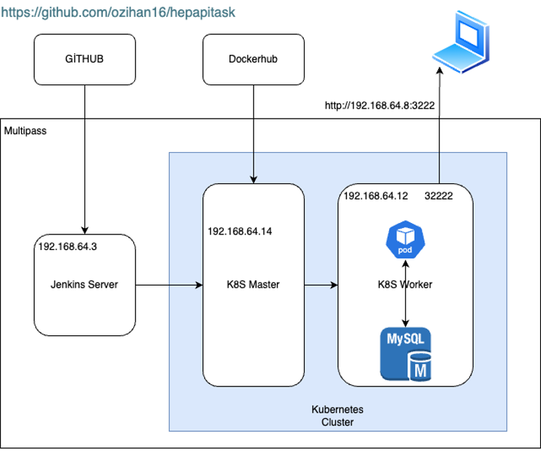
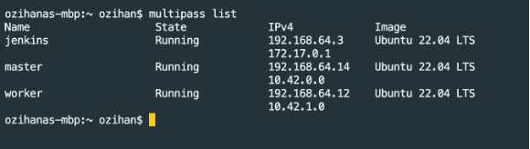
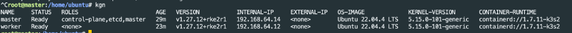
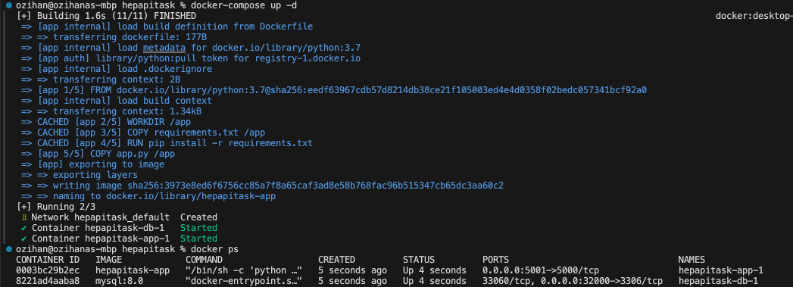
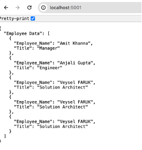
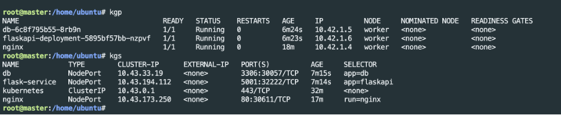
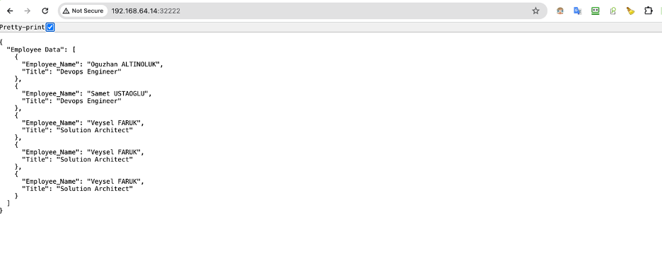

# hepapitask
DevOps Pozisyonu İçin Verilen Task Çalışma Raporu
Hazırlayan: Devops Engineer Oğuzhan Altınoluk

Bahse konu task çalışmasında verilen linklerde bulunan veya benzer bir örnek uygulamanın;
1.	Dockerized hale getirilmesi
2.	Local ortamda docker compose dokümanı hazırlanarak çalıştırılması
3.	Local ortamda bir kubernetes cluster kurulması
4.	Oluşturulan CI-CD yapısı ile bu ortamda örnek uygulamanın ayağa kaldırılması beklenmektedir

Linkte verilen projeler incelenmiş, bağımlılıkların eski versiyonlar olması sebebiyle sorun yaşamamak adına başka bir stabil Flask-API-Mysql projesi üzerinde güncellemeler ve kişiselleştirmeler yapılarak devam edilmesinin daha uygun olacağı değerlendirilmiştir.
Bahse konu uygulamada, başlangıçta MySQL veri tabanında oluşturulan personel bilgilerinin Flask uygulaması tarafından çekilerek web arayüzünde gösterilmesi hedeflenmektedir.

Oluşturulan yapının mimarisi şekilde verilmiştir.

 
Local Ortam Kurulumları:
Multipass:
Bahse konu kubernetes cluster ve jenkins server için local de Multipass ile 3 adet sanal sunucu oluşturuldu.

>multipass launch --name master --cpus 2 --disk 20G --memory 4G

Kubernetes Cluster:
Rancher-RKE2 ile 1 master ve 1 worker dan oluşan bir cluster kurulumu yapıldı.
 

Jenkins server: 
192.168.64.3 IP li sunucuya kurulum yapılarak gerekli docker/docker compose ve kubectl paketleri yüklendi. Kubernetes cluster kube-config dosyası jenkins home dizini .kube/ altına eklendi.

Jenkis UI üzerinde yapılan işlemler:
Kubernetes plugin eklenerek hali hazırda kurulu olan clustera erişim için gerekli konfigürasyon ayarları yapıldı.
Github hesabından projenin çekilebilmesi için github credential bilgileri eklendi.
Dockerhub üzerine oluşturulan imajın gönderilmesi ve çekilebilmesi için credential bilgileri eklendi.
Freestyle ve pipeline projeleri oluşturuldu.

Github hesabında yapılan işlemler:
Bahse konu uygulama, dockerfile ve docker-compose ile manifest (app ve db ye ait deployment ve service) dosyaları oluşturularak https://github.com/ozihan16/hepapitask reposuna eklendi. 
Jenkins pipeline job’ın tetiklenmesi için webhook oluşturuldu. (Ancak jenkins localde çalıştığı için githubdan localdeki sunucuya yönlendirme yapılması amacıyla ngrok gibi toolların kullanılması gerekmektedir)

Docker Compose çalıştırılması:
Hazırlanan docker compose dosyası local ortamda çalıştırılmış ve uygulamanın çalıştığı görülmüştür.
 
 
 

Sonuç olarak;
İster github üzerinden commit yada push ile, ister Jenkins UI üzerinden Build Job ile CI-CD süreci başlatılarak uygulamanın
çalıştırılması ile veriler web arayüzünde görülebilmektedir.
 
 

